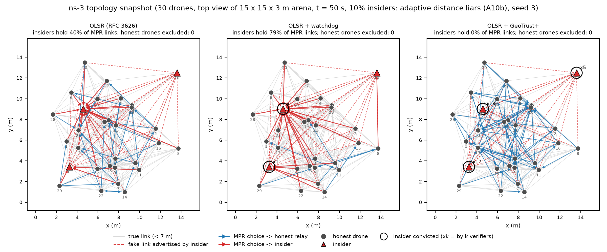

# GeoTrust+: ranging evidence for robust routing in UWB swarms

[](https://doi.org/10.5281/zenodo.23112411)

Code, data and ns-3 patches for the paper

> **Insider attacks as betweenness capture in mobile spatial networks: ranging evidence for robust routing in UWB drone
> swarms**
> Manuscript under review, 2026.

Swarms of drones and robots form mobile spatial networks. Their routing protocols, such as OLSR (RFC 3626), compute paths
on the topology that agents *advertise*, so insiders can falsify it to attract and drop traffic. The paper shows three
things:
- **Insider damage is betweenness capture:** delivery loss equals the fraction of flows routed through an insider.
- **Spatial swarm graphs are clustered enough to audit neighbours' claims.**
- **GeoTrust+ turns the physics of UWB two-way ranging into local convictions** that keep insiders off the routes, even
  when they sit at the most central nodes.

The repository also contains a faithful reproduction of ranging-integrated MPR selection (Zhou et al., *Computer
Networks* 289, 2026), which the paper examines.

<p align="center"></p>

## Contents

| Path | What |
|---|---|
| `geotrust/` | Round-based swarm simulator (PyTorch/NumPy): mobility, DS-TWR ranging, loss model, attacks, verification, MPR algorithms, routing |
| `tests/` | Unit tests (`pytest`) |
| `scripts/` | Experiment drivers, analyses and figure scripts (table below) |
| `eval/calibration.json` | Calibrated verification thresholds per configuration (attack-free, seeds disjoint from evaluation) |
| `eval/results/` | All result tables used in the paper (parquet/CSV, one row per run x method x evaluation instant) |
| `eval/figures/` | Paper figures (PDF + PNG), regenerated by the scripts; `fig_methodology.tex` is the methodology diagram |
| `ns3/` | Patch against **ns-3.48** OLSR, the scenario `geotrust_attack.cc`, build, campaign and topology-snapshot scripts |
| `embedded/` | C port for Cortex-M4F, bit-exact cross-check, QEMU and hardware (DWT) benchmarks |
| `SHA256SUMS` | Checksums of every file |

## Quick start (simulator)

```bash
python -m venv .venv && . .venv/bin/activate      # Windows: .venv\Scripts\activate
pip install -r requirements.txt                   # a CUDA build of torch is optional; CPU works
python -m pytest -q tests                         # 9 tests
PYTHONPATH=. python scripts/quickcheck.py         # one seed, main sparse configuration (seconds on a GPU)
```

Tested on:
- Python 3.11.9, PyTorch 2.14 (CUDA 12.6, GTX 1060 6 GB), NumPy 2.4.6, SciPy 1.17.1, pandas 3.0.5, NetworkX 3.6;
- Windows 11 and WSL Ubuntu 22.04.

The code falls back to the CPU when no GPU is available.

## Reproducing the paper

Every number in the paper comes from the files in `eval/results/`, through these scripts (run from the repository root
with `PYTHONPATH=.`):

| Paper element | Data | Analysis / figure | Regenerate data |
|---|---|---|---|
| Critique of ranging-integrated relay selection | `grid_zhou.parquet` | `zhou_analysis.py`, `figures_final.py` | `run_grid.py --regime zhou` |
| Critique in ns-3 (GRR vs RFC 3626) | `ns3_qall_full.csv` | `ns3_critique_analysis.py` | `ns3/geo_campaign3.sh` |
| Main results, attacks, insider fraction, robustness | `grid_rfc.parquet`, `grid_rfcdense.parquet` (+ `_wilcoxon.csv`) | `rfc_analysis.py <file>`, `figures_final.py` | `run_grid.py --regime rfc` / `rfcdense` |
| Ablation | `grid_abl_sparse.parquet`, `grid_abl_dense.parquet` | `expansion_analysis.py` | `run_grid.py --regime abl_sparse --seeds 20` / `abl_dense` |
| Threshold sensitivity | `grid_sens_sparse.parquet`, `grid_sens_dense.parquet` | `expansion_analysis.py`, `fig_sensitivity.py` | `run_grid.py --regime sens_sparse` / `sens_dense` |
| Network structure (RGG vs Erdos-Renyi, auditability, churn) | `netsci_structure.csv` | `netsci_structure.py` | same script |
| Betweenness capture and targeted placement | `grid_net_sparse.parquet`, `grid_net_dense.parquet` | `fig_netsci.py` | `run_grid.py --regime net_sparse --seeds 20` / `net_dense` |
| ns-3 lie attacks | `ns3_lies.csv`, `ns3_lies_f20.csv` | `ns3_lies_analysis.py` | `ns3/geo_campaign5.sh` |
| PLOS ONE figure files (Fig1-6.tif: Arial, 8-12 pt, 300 dpi, LZW) | as above | `plos_figs.py` | - |
| ns-3 network topology (appendix) | `ns3_topo_shrink_*_s3.csv` | `fig_ns3_topology.py shrink 3 [--paper]` | `ns3/geo_topo.sh shrink 3` |
| Supplementary ns-3 link-spoofing campaign | `ns3_rfc*.csv` | `ns3_rfc_analysis.py` | `ns3/geo_campaign4.sh` |
| MCU cost | `embedded/qemu_hw_test.txt` | `embedded/parse_hw.py` | `embedded/build_hw.sh --qemu` |
| Replication of Zhou et al. (acceptance test) | `replication.parquet` | - | `replication.py` |

`run_grid.py` writes one part file per job and skips jobs whose part file exists, so interrupted campaigns resume. A full
30-seed regime takes 1-5 h on the test machine with 3 worker processes (about 1 GB RAM each; use `--workers` to adapt).

Statistics:
- Each cell is the mean over seeds with a 95 % t-interval.
- Paired comparisons use the Wilcoxon signed-rank test on per-seed means.
- Evaluation seeds are 0-29 (ablation and targeted placement 0-19; ns-3 1-20); calibration uses separate seeds.

## ns-3

```bash
git clone https://gitlab.com/nsnam/ns-3-dev.git && cd ns-3-dev && git checkout ns-3.48
patch -p1 < /path/to/repo/ns3/ns3.48-olsr-geotrust.patch
cp /path/to/repo/ns3/geotrust_attack.cc scratch/
./ns3 configure --build-profile=optimized --enable-examples && ./ns3 build geotrust_attack
```

The patch adds three things to OLSR:
- `MprMode` 2/3: RFC 3626 heuristic with exclusions; `GrrQmin` for Zhou's GRR;
- an exclusion predicate for MPR selection and a quarantine predicate for route computation;
- a HELLO-lie hook for insider link spoofing.

The scenario option `--topo=<file.csv> --topoK=<interval>` writes a topology snapshot (positions, roles, MPR sets, fake
links, convictions). The campaign scripts assume the tree at `~/ns-3-geotrust`; set the paths at their top. We checked
that the patch applied to the `ns-3.48` tag reproduces the patched sources byte for byte.

## MCU port

- `embedded/geotrust_verify.c` holds the per-interval verification: reciprocity graph and vertex cover, kinematic test,
  loss clamp and watchdog. It is bit-exact with the Python verifier: `scripts/mcu_crosscheck_gen.py` generates 400 cases
  and `embedded/crosscheck.c` compares them, with 0 mismatches.
- `embedded/build_hw.sh --qemu` runs the benchmark on QEMU's STM32F405 model and reports instruction counts.
- `embedded/run_hw.sh` flashes the same binary to an STM32F405/F407 board and measures cycles with the DWT counter at
  168 MHz. See `embedded/HW_TIMING.md`.
- AES comes from tiny-AES-c (public domain, `embedded/tiny-AES-c/unlicense.txt`).

## Licences

- Code (`geotrust/`, `scripts/`, `tests/`, `embedded/*.c|h|sh|ld|py`, `ns3/*.sh`, `ns3/geotrust_attack.cc`): MIT, see
  `LICENSE`.
- The ns-3 patch modifies GPL-2.0 ns-3 sources and is therefore GPL-2.0-only.
- Data and figures (`eval/`): CC BY 4.0.
- tiny-AES-c: Unlicense.

## Changes

- **v1.0.1**: legends of `fig_zhou_diag`, `fig_sensitivity` and `fig_netsci` moved off the data (figures regenerated); `scripts/plos_figs.py` and the PLOS ONE figure files in `eval/figures/plos/`; citation metadata completed. No change to code paths, data or results.
- **v1.0.0**: first release.

## Citation

See `CITATION.cff`. Please cite the paper and the archived version of this repository: Zenodo, doi:10.5281/zenodo.23112412 (version 1.0.1); all versions: doi:10.5281/zenodo.23112411.
